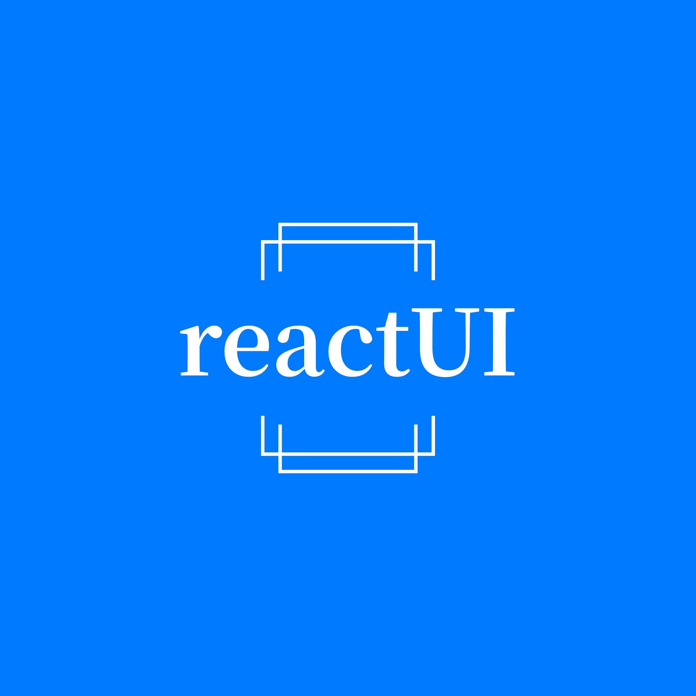

<p align="center">
  <a href="">
    
  </a>
</p>

<h1 align="center">React UI</h1>

<div align="center">

React 集成了项目中一些常用但不常见的组件。

[![NPM version][npm-image]][npm-url] [![NPM downloads][download-image]][download-url]

[![FOSSA Status][fossa-image]][fossa-url] [![Discussions][discussions-image]][discussions-url] [![][issues-helper-image]][issues-helper-url] [![Issues need help][help-wanted-image]][help-wanted-url]

[npm-image]: http://img.shields.io/npm/v/antd.svg?style=flat-square
[npm-url]: http://npmjs.org/package/antd
[github-action-image]: https://github.com/ant-design/ant-design/workflows/%E2%9C%85%20test/badge.svg
[github-action-url]: https://github.com/ant-design/ant-design/actions?query=workflow%3A%22%E2%9C%85+test%22
[david-image]: https://img.shields.io/david/ant-design/ant-design?style=flat-square
[david-dev-url]: https://david-dm.org/ant-design/ant-design?type=dev
[david-dev-image]: https://img.shields.io/david/dev/ant-design/ant-design?style=flat-square
[david-url]: https://david-dm.org/ant-design/ant-design
[download-image]: https://img.shields.io/npm/dm/antd.svg?style=flat-square
[download-url]: https://npmjs.org/package/antd
[lgtm-image]: https://flat.badgen.net/lgtm/alerts/g/ant-design/ant-design
[lgtm-url]: https://lgtm.com/projects/g/ant-design/ant-design/alerts/
[fossa-image]: https://app.fossa.io/api/projects/git%2Bgithub.com%2Fant-design%2Fant-design.svg?type=shield
[fossa-url]: https://app.fossa.io/projects/git%2Bgithub.com%2Fant-design%2Fant-design?ref=badge_shield
[help-wanted-image]: https://flat.badgen.net/github/label-issues/ant-design/ant-design/help%20wanted/open
[help-wanted-url]: https://github.com/ant-design/ant-design/issues?q=is%3Aopen+is%3Aissue+label%3A%22help+wanted%22
[discussions-image]: https://img.shields.io/badge/discussions-on%20github-blue?style=flat-square
[discussions-url]: https://github.com/ant-design/ant-design/discussions
[bundlesize-js-image]: https://img.badgesize.io/https:/unpkg.com/antd/dist/antd.min.js?label=antd.min.js&compression=gzip&style=flat-square
[bundlesize-css-image]: https://img.badgesize.io/https:/unpkg.com/antd/dist/antd.min.css?label=antd.min.css&compression=gzip&style=flat-square
[unpkg-js-url]: https://unpkg.com/browse/antd/dist/antd.min.js
[unpkg-css-url]: https://unpkg.com/browse/antd/dist/antd.min.css
[issues-helper-image]: https://img.shields.io/badge/Issues%20Manage%20By-issues--helper-orange?style=flat-square
[issues-helper-url]: https://github.com/actions-cool/issues-helper

</div>

[](https://ant.design/index-cn)

## ✨ 特性

- 🌈 复杂组件。
- 📦 开箱即用的高质量 React 组件。
- 🛡 使用 TypeScript 开发，提供完整的类型定义文件。
- 🎨 深入每个细节的主题定制能力。

## 🖥 兼容环境

- 现代浏览器和 IE11（需要 [polyfills](https://ant.design/docs/react/getting-started-cn#兼容性)）。
- 支持服务端渲染。

| [](http://godban.github.io/browsers-support-badges/)<br>IE / Edge | [](http://godban.github.io/browsers-support-badges/)<br>Firefox | [](http://godban.github.io/browsers-support-badges/)<br>Chrome | [](http://godban.github.io/browsers-support-badges/)<br>Safari | [](http://godban.github.io/browsers-support-badges/)<br>Electron |
| -------------------------------------------------------------------------------------------------------------------------------------------------------------------------------------------------------------- | ---------------------------------------------------------------------------------------------------------------------------------------------------------------------------------------------------------------- | ------------------------------------------------------------------------------------------------------------------------------------------------------------------------------------------------------------ | ------------------------------------------------------------------------------------------------------------------------------------------------------------------------------------------------------------ | -------------------------------------------------------------------------------------------------------------------------------------------------------------------------------------------------------------------- |
| IE11, Edge                                                                                                                                                                                                     | last 2 versions                                                                                                                                                                                                  | last 2 versions                                                                                                                                                                                              | last 2 versions                                                                                                                                                                                              | last 2 versions                                                                                                                                                                                                      |

## 📦 安装

```bash
npm install react-ui --save
```

```bash
yarn add antd
```

## 🔨 示例

### 🌈 定制主题

参考 [定制主题](https://ant.design/docs/react/customize-theme-cn) 文档。

### 🛡 TypeScript

参考 [在 TypeScript 中使用](https://ant.design/docs/react/use-in-typescript-cn)。

## 🌍 国际化

参考 [国际化文档](https://ant.design/docs/react/i18n-cn)。

## 🔗 链接

- [首页](https://ant.design/)
- [开发者说明](https://github.com/ant-design/ant-design/wiki/Development)
- [版本发布规则]()
- [常见问题](https://ant.design/docs/react/faq-cn)
- [定制主题](https://ant.design/docs/react/customize-theme-cn)
- [国际化](https://ant.design/docs/react/i18n-cn)
- [成为社区协作成员](https://github.com/ant-design/ant-design/wiki/Collaborators#how-to-apply-for-being-a-collaborator)

## ⌨️ 本地开发

```bash
$ git clone git@github.com:ant-design/ant-design.git
$ cd ant-design
$ npm install
$ npm start
```

打开浏览器访问 http://127.0.0.1:8001 ，更多[本地开发文档](https://github.com/ant-design/ant-design/wiki/Development)。

## 🤝 参与共建 [](http://makeapullrequest.com)

请参考[贡献指南](https://ant.design/docs/react/contributing-cn).
